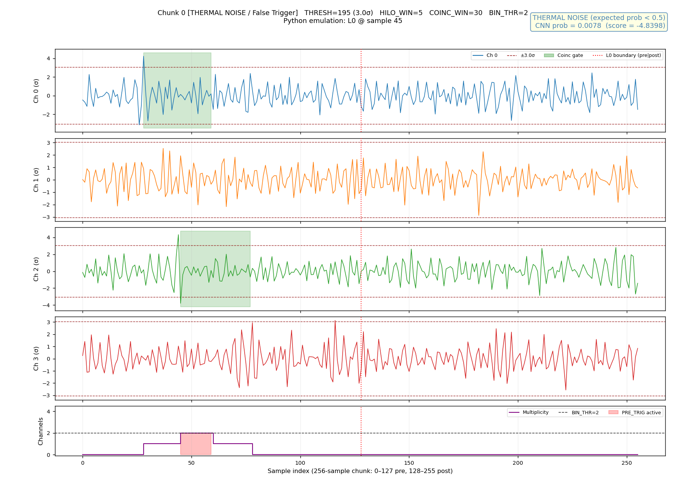
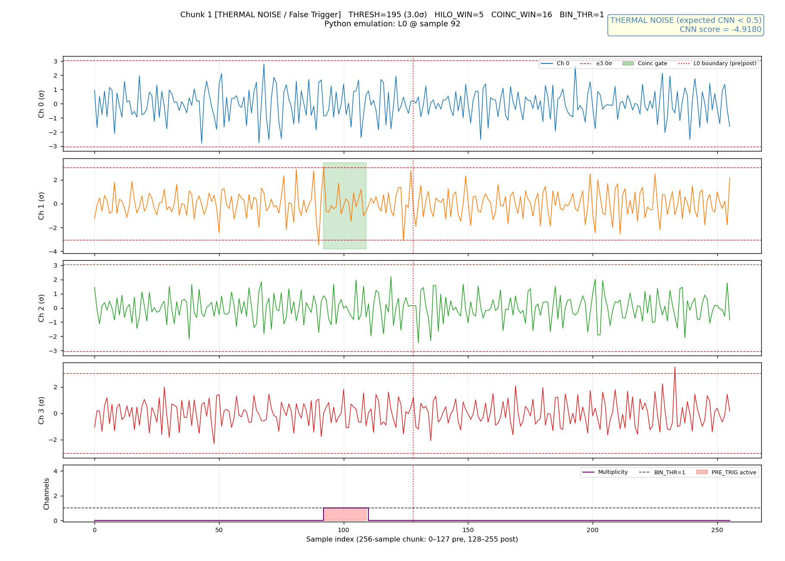
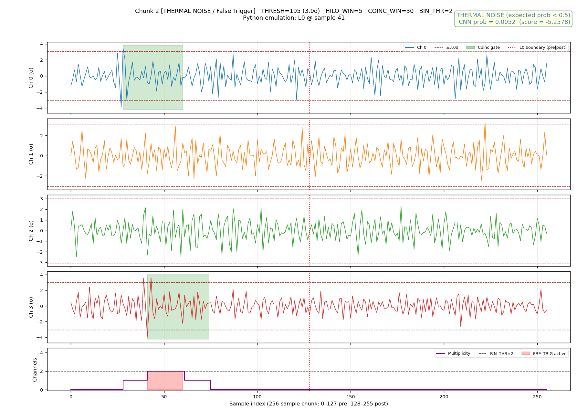

# Hi-Lo Gated CNN Trigger
[](LICENSE)

## Introduction

A Hi-Lo Gated CNN Trigger for ARIANNA, a neutrino experiment. This is a submodule for the DAQ System. This module is a 4-channel trigger, composed of a Hi-Lo pre-trigger followed by an AI trigger. [Here](https://github.com/NuDAQ/Hi-Lo-Trigger) is the repository for the Hi-Lo trigger.

### The Structure

#### Module Hierarchy

```
HILO_CNN_TRIGGER              hw/rtl/HILO_CNN_TRIGGER.vhd   (top-level, structural)
├── ADC_STREAM_FIFO           hw/rtl/ADC_STREAM_FIFO.vhd    — elastic ADC batch FIFO
├── PRE_TRIGGER               [dep: hilo-trigger v2.2.4]    — L0 bipolar pre-trigger
│   ├── PRE_TRIGGER_1CH × 4
│   └── MULT2BIN × 32
├── CNN_CHUNK_CAPTURE         hw/rtl/CNN_CHUNK_CAPTURE.vhd  — ring buffer + 12-buffer circular queue + rate blanking + CDC
└── WRAPPER_TOP               [dep: cnn-core-wrapper v1.0.1] — CNN AXI-Stream wrapper
    └── cnn_core              [dep: cnn-core v1.0.4]         — HLS-generated RTL
```

#### Data Flow

```
ADC_DATA4  (4 ch × 16 samples × 12-bit, CLK_ADC domain)
    │
    ▼
ADC_STREAM_FIFO   (FIFO_DEPTH-batch elastic buffer, CLK_ADC domain)
    │
    ├──► PRE_TRIGGER ─────────────────────────────────► L0_PRE_TRIG (out)
    │         bipolar threshold + coincidence window
    │                   │
    │              L0_PRE_TRIG (internal)
    │                   │
    └──► CNN_CHUNK_CAPTURE
              │
              │  CLK_ADC: Pre-trigger ring buffer (8 batches = 128 samples)
              │           Post-trigger capture    (8 batches = 128 samples)
              │           Total chunk: 256 samples → 12-buffer circular queue
              │           Rate monitor → L0_BLANKING (noise suppression)
              │
              │  [True Dual-Port BRAM, 3072 × 64-bit (12 × 256)]
              │  [4-phase CDC handshake, 12-bit wide]
              │
              │  CLK_CNN: Stream 256 × 64-bit words to WRAPPER_TOP
              │
              └──► WRAPPER_TOP ──► cnn_core ──► CNN_OUT_DATA / CNN_OUT_VALID
```

#### Clock Domains

| Clock    | Typical frequency | Responsibilities                                      |
|----------|-------------------|-------------------------------------------------------|
| `CLK_ADC`| 62.5 MHz          | ADC ingestion, Hi-Lo trigger, ring buffer, BRAM write |
| `CLK_CNN`| 200 MHz           | CNN streaming (AXI-S), BRAM read, WRAPPER_TOP control |

`RST` is shared (active-high, synchronous to `CLK_ADC`).
`CNN_CHUNK_CAPTURE` re-times it into the `CLK_CNN` domain via a 2-FF synchronizer
and drives the active-low `rst_n` that `WRAPPER_TOP` requires.

#### Chunk Window

| Region       | Batches | Samples | BRAM addresses |
|--------------|---------|---------|----------------|
| Pre-trigger  | 8       | 128     | 0 – 127        |
| Post-trigger | 8       | 128     | 128 – 255      |
| **Total**    | **16**  | **256** | **0 – 255**    |

Alignment is batch-granular (±15 samples): the triggering batch is the first
post-trigger batch (addr 128). Signal events typically span tens of samples,
so batch-level alignment is sufficient.

64-bit word format (one sample across 4 channels):
```
[63:48] ch3 (4-bit pad | 12-bit ADC)
[47:32] ch2
[31:16] ch1
[15: 0] ch0
```

#### Top-Level Port Interface (`HILO_CNN_TRIGGER`)

**Generics**

| Generic      | Default    | Description                                                                                      |
|--------------|------------|--------------------------------------------------------------------------------------------------|
| `CLK_ADC_HZ` | 62_500_000 | CLK_ADC frequency in Hz. Propagates to `CNN_CHUNK_CAPTURE` so the 50 µs rate-monitor window is correct at any CLK_ADC rate. |
| `FIFO_DEPTH` | 8          | Depth of `ADC_STREAM_FIFO` in 16-sample batches. Absorbs rate mismatch when CLK_ADC runs faster than the ADC batch delivery rate. |

**Ports**

| Port            | Dir | Width | Clock    | Description                              |
|-----------------|-----|-------|----------|------------------------------------------|
| `CLK_ADC`       | in  | 1     | —        | ADC batch clock                          |
| `CLK_CNN`       | in  | 1     | —        | CNN inference clock                      |
| `RST`           | in  | 1     | CLK_ADC  | Shared active-high synchronous reset     |
| `DATA_STR`      | in  | 1     | CLK_ADC  | Data strobe — one pulse per 16-sample batch |
| `ADC_DATA4`     | in  | 4×16×12 | CLK_ADC | ADC samples, `adc_data4_type`           |
| `THRESH`        | in  | 12    | static   | Absolute threshold (ADC counts)          |
| `HILO_WINDOW`   | in  | 5     | static   | Hi-Lo bipolar gate window per channel (0–16 samples) |
| `COINC_WINDOW`  | in  | 6     | static   | Channel coincidence smear (0–32 samples, independent of batch size) |
| `BIN_THR`       | in  | 4     | static   | Min active channels for `L0_PRE_TRIG`   |
| `L0_PRE_TRIG`   | out | 1     | CLK_ADC  | Real-time L0 pre-trigger output          |
| `CNN_OUT_DATA`  | out | 32    | CLK_CNN  | CNN inference score (AXI-S data)         |
| `CNN_OUT_VALID` | out | 1     | CLK_CNN  | AXI-S valid                             |
| `CNN_OUT_READY` | in  | 1     | CLK_CNN  | AXI-S ready                             |
| `CHUNK_OVERFLOW`| out | 1     | CLK_ADC  | Sticky: trigger dropped (circular queue full, outside blanking) |
| `L0_BLANKING`   | out | 1     | CLK_ADC  | High while rate-based L0 noise blanking is active |

#### Instantiating for Multiple Antenna Pairs

The module accepts exactly 4 ADC channels. For an 8-channel system (two
antenna pairs), instantiate twice at a higher level:

```vhdl
u_TRIG_A : entity work.HILO_CNN_TRIGGER
    port map (ADC_DATA4 => adc(0 to 3), CLK_ADC => clk_adc, ...);

u_TRIG_B : entity work.HILO_CNN_TRIGGER
    port map (ADC_DATA4 => adc(4 to 7), CLK_ADC => clk_adc, ...);
```

#### 12-Buffer Circular Queue and Rate-Based L0 Blanking

**Circular queue** — `CNN_CHUNK_CAPTURE` maintains 12 BRAM slots (3072 × 64-bit).
The ADC side writes to `wr_ptr` and advances it mod 12 after each chunk; the CNN
side reads from `rd_ptr` (also mod 12) in strict FIFO order.  With a CNN latency
< 17 µs and a design goal of ≤ 1 trigger per 20 µs, the 12-slot depth absorbs
Poisson bursts with ≈ 2σ headroom before blanking engages.

**Rate-based L0 blanking** — A fixed-window rate monitor (50 µs, `WINDOW_CYCLES`
CLK_ADC cycles) counts *all* raw L0 pulses, including those that arrive while
blanking is already active.  `WINDOW_CYCLES` is derived at elaboration time from
the `CLK_ADC_HZ` generic (`CLK_ADC_HZ / 20_000`), so the window remains 50 µs
regardless of the actual CLK_ADC frequency.  All other threshold parameters are
compile-time constants in `CNN_CHUNK_CAPTURE.vhd`:

| Constant        | Default | Meaning                                      |
|-----------------|---------|----------------------------------------------|
| `N_BUF`         | 12      | Circular queue depth                         |
| `WINDOW_CYCLES` | `CLK_ADC_HZ / 20_000` | Rate-monitor window; always 50 µs — derived from `CLK_ADC_HZ` generic (default: 3125 cycles @ 62.5 MHz). |
| `HI_THRESH`     | 10      | Enter blanking: ≥ 10 L0 per window (1/5 µs)  |
| `LO_THRESH`     | 3       | Exit blanking:  ≤ 3  L0 per window (<1/15 µs)|

Blanking is evaluated only at each window boundary (natural hold-off).
The exit condition is **both** rate ≤ `LO_THRESH` **and** the circular queue
fully drained — preventing a premature restart while CNN is still draining
buffered noise events.

During blanking, L0 pulses are **silently discarded** — `CHUNK_OVERFLOW` is
*not* set (intentional discard differs from a resource overflow).
`CHUNK_OVERFLOW` fires only when a non-blanking L0 arrives but `wr_ptr`'s slot
is still occupied by an unprocessed buffer.  Wire both `CHUNK_OVERFLOW` and
`L0_BLANKING` to ILA probes or slow-control status registers for run-time monitoring.

#### CNN_CHUNK_CAPTURE Internal State Machines

**ADC FSM (CLK_ADC)**

| State       | Action                                                                             |
|-------------|------------------------------------------------------------------------------------|
| `ADC_IDLE`  | Continuously overwrites an 8-slot ring buffer. If `L0_PRE_TRIG` rises: check `l0_blanking` — if asserted, silently discard; otherwise claim `wr_ptr` slot (set `CHUNK_OVERFLOW` if occupied). |
| `ADC_POST`  | Captures the 8 batches following the trigger (128 post-trigger samples).           |
| `ADC_WRITE` | Writes all 256 words to `bram[wr_ptr*256 .. wr_ptr*256+255]` at full CLK_ADC rate. Sets `buf_written_adc(wr_ptr)`, advances `wr_ptr` mod `N_BUF`, returns to `ADC_IDLE`. |

**CNN FSM (CLK_CNN)**

| State          | Action                                                                                                     |
|----------------|------------------------------------------------------------------------------------------------------------|
| `CC_IDLE`      | Checks `buf_written_cnn(rd_ptr)='1' AND buf_ack_cnn(rd_ptr)='0'`. Processes buffers in FIFO order; waits if `rd_ptr`'s slot is not yet written. |
| `CC_STREAM`    | Asserts `CNN_START` + `CNN_IN_VALID` + first BRAM word simultaneously. Holds `CNN_IN_VALID` high for all 256 words with no gaps. Clears `CNN_START` only when `CNN_READY` rises (`ap_ctrl_hs`). |
| `CC_WAIT_DONE` | Waits for `CNN_DONE` (`ap_done`).                                                                           |
| `CC_ACK`       | Sets `buf_ack_cnn(cnn_buf_id)`, advances `rd_ptr` mod `N_BUF`, returns to `CC_IDLE`.                      |

**CDC Handshake Protocol**

The handshake uses a 4-phase set/clear protocol, not a single-cycle pulse:

1. ADC side sets `buf_written_adc` (CLK_ADC domain) after BRAM write completes.
2. `buf_written_cnn` is the 2-FF synchronized copy visible in CLK_CNN domain.
3. CNN side sets `buf_ack_cnn` (CLK_CNN domain) after inference completes.
4. `buf_ack_adc` (synchronized back to CLK_ADC) clears `buf_written_adc`.

Both `buf_written_adc` and `buf_ack_cnn` are held until the other side acknowledges. This tolerates arbitrary clock-domain skew without a pulse-stretcher.  Both signals are `N_BUF`-bit vectors; each bit corresponds to one circular-queue slot.

**RST Synchronizer Initialization**

The 2-FF RST synchronizer signals (`rst_s1`, `rst_cnn`) are declared with initial value `'1'`:

```vhdl
signal rst_s1  : std_logic := '1';
signal rst_cnn : std_logic := '1';
```

This sets `RST_N_CNN = '0'` (active-low) at simulation time 0 — before any `CLK_CNN` edges — so `cnn_core` receives a proper reset from the start. Without this, XSim leaves `ap_idle` uninitialized (`'x'`) because the HLS-generated Verilog uses blocking assignments whose initial values depend on reset.

## Simulation

### Thermal Noise Test

`scripts/run_thermal_sim.sh` streams continuous thermal noise data through the
full pipeline and captures the first N chunks that pass `L0_PRE_TRIG`. The
stimulus is pre-converted from the ARIANNA thermal noise dataset
(`Hi-Lo-Trigger/analysis/data/thermal`) by `prepare_thermal_sim.py`.

**Running**

```bash
bash scripts/run_thermal_sim.sh [--skip-data] [--skip-plot]
```

`--skip-data` reuses an existing `stimulus.txt`; `--skip-plot` skips the Python plotting step.

**Sample output** (CNN probability should be well below 0.5 for all thermal chunks):





**Default trigger configuration**

| Parameter      | Value | Description                          |
|----------------|-------|--------------------------------------|
| `THRESH`       | 195   | Read from `stim_meta.txt` (3σ)       |
| `HILO_WINDOW`  | 5     | Samples                              |
| `COINC_WINDOW` | 30    | Samples (spans ~2 batches)           |
| `BIN_THR`      | 2     | Min channels in coincidence          |

**What the test verifies**

All captured chunks are thermal noise — CNN probability (sigmoid of output score)
should be well below 0.5 for every chunk. Per-chunk results are written to
`hw/sim/thermal_data/cnn_results.txt`; waveform plots to
`hw/sim/thermal_data/plots/`.

**Timing note**

`PRE_TRIG` is a combinational output of `PRE_TRIGGER`. In mixed-language
simulation (SV + VHDL), the SV testbench reads the settled combinational value
after each `@(posedge clk_adc)`, while the VHDL `ADC_FSM` samples the
pre-delta value at the same edge — a 1-cycle skew. `tb_thermal.sv` compensates
with one alignment cycle between L0 detection and the start of the post-trigger
capture loop.

---

### <s>anity Test<s> (The current version does not support this feature)

`scripts/run_sanity_sim.sh` runs a self-contained XSim batch simulation against
3 signal and 1 noise events from the `cnn-core-wrapper` test dataset.

**Prerequisites**

- Vivado 2023.x (or compatible): `xvhdl`, `xvlog`, `xelab`, `xsim` on PATH.
- `bender update` completed (all checkouts present).
- Python 3 with `numpy` and `matplotlib`.

**Running**

```bash
cd <project root>
bash scripts/run_sanity_sim.sh
```

Steps executed by the script:

1. `prepare_sanity_chunks.py` — scans `cnn-core-wrapper/testhex_stream/` for bipolar
   signal events (any channel with both a sample > +THRESH and a sample < −THRESH).
   Copies 3 signal + 1 noise hex files to `hw/sim/sanity_data/`.
2. Generates `hw/sim/sanity_data/sanity_paths.svh` with absolute paths for
   `$readmemh` (Verilog does not accept relative paths in XSim).
3. Compiles RTL: `xvhdl` for VHDL files, `xvlog -sv` for SystemVerilog.
4. Elaborates with `xelab`, runs with `xsim --runall`.
5. Calls `plot_sanity_results.py` → `hw/sim/sanity_data/sanity_plots.png`.

**What the test verifies**

| Check                          | Expected outcome                                          |
|-------------------------------|-----------------------------------------------------------|
| `L0_PRE_TRIG` for signal events | Fires within 2 ADC cycles (64 ns) of the triggering batch |
| `L0_PRE_TRIG` for noise event   | Does not fire (or CNN score ≤ +0.5 if it does)          |
| CNN output for signal events   | `$signed(CNN_OUT_DATA[16:0]) / 256.0 > +0.5`            |
| CNN inference latency          | Typically 10–30 µs at 200 MHz (256 words at full throughput) |
| `CHUNK_OVERFLOW`               | Set during high-amplitude events (expected — see Known Limitations) |

Pass/fail results are written to `hw/sim/sanity_data/sanity_results.txt`.
ADC waveforms (all 4 events × 256 samples) are written to `sanity_wave.csv`.

**Diagnosing failures**

```bash
python3 scripts/diagnose_sanity.py --thresh 300
```

This checks hex file format, bipolar threshold crossings, Python Hi-Lo emulation,
waveform consistency between `sanity_wave.csv` and the source hex files, and
prints a per-event summary of the simulation results.

## Known Limitations

1. **Capture window for high-amplitude sanity data.**
   The sanity chunks are taken from the `cnn-core-wrapper` test dataset, where
   data is pre-scaled to ap_fixed<12,6> range (peak amplitude ~±2000 counts).
   With THRESH=300, `L0_PRE_TRIG` fires on the first ADC batch of the event.
   At that point the 8-slot pre-trigger ring buffer holds the 3 priming
   zero-batches (fed before the event) plus batch 0 of the event, leaving the
   remaining 4 slots as zeros. The CNN therefore receives
   `[64 zeros | event samples 0–191]` rather than a centred 256-sample window.
   Events whose score depends on the later half of the waveform may be
   misclassified. This is a test-setup issue; the RTL window logic is correct.

2. **Normalization between raw ADC and CNN input scale.**
   The CNN was trained on data normalized to approximately `ADC_count / noise_σ`.
   In hardware, raw ADC values span ±2048 counts while the CNN expects inputs
   in the ap_fixed<12,6> range (±32 before the decimal point). A pre-processing
   stage — divide by the per-channel noise σ, clamp to ±2047 — must be inserted
   between the ADC and `CNN_CHUNK_CAPTURE` before production deployment. The
   current RTL passes raw ADC data directly, which is correct for end-to-end
   simulation of the pipeline but not for hardware deployment against physical ADC inputs.

3. **CHUNK_OVERFLOW set during high-amplitude events.**
   A single signal event with amplitude well above THRESH can cause
   `L0_PRE_TRIG` to re-assert during the `ADC_POST` capture phase because
   successive batches continue to exceed the bipolar threshold. The ADC FSM
   discards these secondary triggers (capture already in progress) and sets
   `CHUNK_OVERFLOW`. This is expected behavior; it does not indicate a timing
   collision between separate events.  Note: environmental noise bursts that
   would cause this are suppressed by the rate-based blanking mechanism before
   `CHUNK_OVERFLOW` has time to accumulate.

## License
This project is licensed under the SHL-2.1 License. See the [LICENSE](LICENSE).

---
> The remaining part is for developers. End-users should focus on the above sections only.

## Bender

This project supports the usage of Bender, a dependency management tool for hardware design projects which provides a way to define dependencies among IPs, execute unit tests, and verify that the source files are valid input for various simulation and synthesis tools. For more information regarding the installation and the usage of Bender please look at its repo [link](https://github.com/pulp-platform/bender).

1. Add source files to your working directory or declare new external IPs, in `Bender.yml`.
2. `Bender Update`.
3. `bender script vivado` for the vivado script.

How to write `Bender.yml`?

```yml
package:
  name: my_project
  description: "Description for this project."
  authors:
    - "Albert <albert@example.com>" # current maintainer
    - "Albert <albert@example.com>" # current maintainer

dependencies:
  # METHODOLOGY FIX: Never track a moving branch like 'main'. 
  # Pin to exact semantic versions or commit hashes to guarantee reproducible builds.
  common_cells: { git: "https://github.com/pulp-platform/common_cells.git", version: 1.37.0 }
  mydep: { git: "git@github.com:pulp-platform/common_verification.git", rev: "<commit-ish>" }
  mydep: { git: "git@github.com:pulp-platform/common_verification.git", version: "1.1" }

sources:
  # Source files grouped in levels. Files in level 0 have no dependencies on files in this
  # package. Files in level 1 only depend on files in level 0, files in level 2 on files in
  # levels 1 and 0, etc. Files within a level are ordered alphabetically.
  # Level 0
  - src/axi_pkg.sv
  # Level 1
  - src/axi_intf.sv
  # Level 2
  - src/axi_atop_filter.sv
  - src/axi_burst_splitter_gran.sv
  - src/axi_burst_unwrap.sv

  - target: synth_test
    files:
      - test/axi_synth_bench.sv

  - target: simulation
    files:
      - src/axi_chan_compare.sv
      - src/axi_dumper.sv
      - src/axi_sim_mem.sv
      - src/axi_test.sv
```
## Developer Notes

- **Updating the CNN model**: replace `models/hgq_config_*.keras` in the
  `cnn-core` repo, re-run `vitis_hls -f build_prj.tcl`, then bump the
  `cnn-core` version in `Bender.yml` and run `bender update`.
- **Changing batch size**: `N_SAMPLES` (16 by default) is a package constant in
  `hilo-trigger`. Changing it requires a coordinated update of that dependency
  and all files in this repo that assume 16 samples per batch.
- **CHUNK_OVERFLOW**: fires only outside blanking, when all 12 circular-queue
  slots are occupied.  Under normal neutrino-signal rates (≪ 1/20 µs) this
  should never fire.  If it does during physics running, reduce the trigger rate
  (increase `BIN_THR` or widen `THRESH`) or increase `N_BUF`.
  `L0_BLANKING` engaging is the normal response to noise bursts and does not
  constitute an overflow.
- **Mixed-language simulation**: `HILO_CNN_TRIGGER_TB_WRAP.vhd` bridges the
  flat SV vector to `adc_data4_type`. Packing convention must match the
  generate block in `tb_hilo_cnn_trigger.sv` — both use MSB-first, ch0 at
  the low end.
- **ap_ctrl_hs protocol (WRAPPER_TOP / cnn_core)**:
  `CNN_START` must be held high until `CNN_READY` (ap_ready) rises. A
  single-cycle pulse is not sufficient — the HLS core samples ap_start on the
  ap_ready rising edge, not on the first assertion.
  `CNN_IN_VALID` must be asserted on the same clock edge as `CNN_START`, with
  the first input word already present on `CNN_IN_DATA`. Any bubble in the
  input stream stalls the ap_fixed<12,6> datapath inside the HLS core and may
  cause incorrect inference results.
- **Diagnostic `report` statements**: `CNN_CHUNK_CAPTURE.vhd` contains
  two concurrent `process` blocks that emit VHDL `report` messages on changes
  to `CNN_IDLE` and `buf_written_cnn`. These should be removed before
  synthesizing for hardware.
- **CLK_ADC frequency**: Always set `CLK_ADC_HZ` in the `HILO_CNN_TRIGGER`
  generic map to match the actual CLK_ADC frequency. The default (62_500_000)
  is applied when no override is provided, including all existing simulation
  scripts, which run at 62.5 MHz or 31.25 MHz. At 31.25 MHz the blanking window
  becomes 100 µs instead of 50 µs; this is acceptable for simulation but should
  be corrected for hardware deployment.
- **ADC_STREAM_FIFO**: The elastic FIFO (`ADC_STREAM_FIFO.vhd`, depth
  `FIFO_DEPTH` batches) is instantiated inside `HILO_CNN_TRIGGER` before both
  `PRE_TRIGGER` and `CNN_CHUNK_CAPTURE`. When CLK_ADC equals the ADC batch rate
  (nominal case), the FIFO acts as a one-cycle pipeline register with no
  functional impact. When CLK_ADC is faster, the FIFO absorbs the rate mismatch
  so that both downstream modules always receive a gapless batch stream.
  `FIFO_DEPTH` need only be increased if sustained CLK_ADC-to-batch-rate ratios
  exceed 8×, which is outside the intended operating range.
  